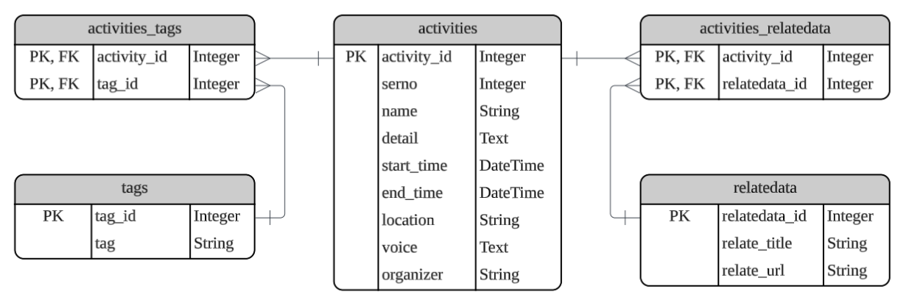

# Eventure

A web application that helps users discover **events** and **activities** happening in Hsinchu City.

# API Introduction

## Hshinchu City Government Web OpenAPI

- Introduction: Getting activity information from Hsinchu government.
- Request URL:
  
  ```
  https://webopenapi.hccg.gov.tw/v1/Activity?top=100
  ```
  
    - `top`: The number of records to return (Maximum = 100)
- Request Header:
    
    ```
    {
      "Accept": "application/json"
    }
    ```
    
- Response Data
    
    After calling thie API, it will return the detail of the activities, and here are some infromation that might be helpful for our final project.

    - **Issuing Unit**: Refers to the organization that hosts or announces activities.  
    - **Activity**: Represents the event or program users can attend. 
    - **Organizer**: The main entity responsible for hosting the event.  
    - **Co-organizer**: Additional entities that assist in hosting the event.  
    - **Location**: Where the event takes place.  
    - **Start Date** / **End Date**: The schedule of the event.  
    - **Details**: Additional information describing the event.  
    - **Classification**: Used to categorize events based on two types:
      - **Subject Classification**: Describes the theme or topic of the event (e.g., culture, education, sports).  
      - **Service Classification**: Describes the target audience or service category (e.g., general public, youth, elderly).

- Entity-Relationship Diagram

  <table>
    <tr>
      <td></td>
    </tr>
  </table>